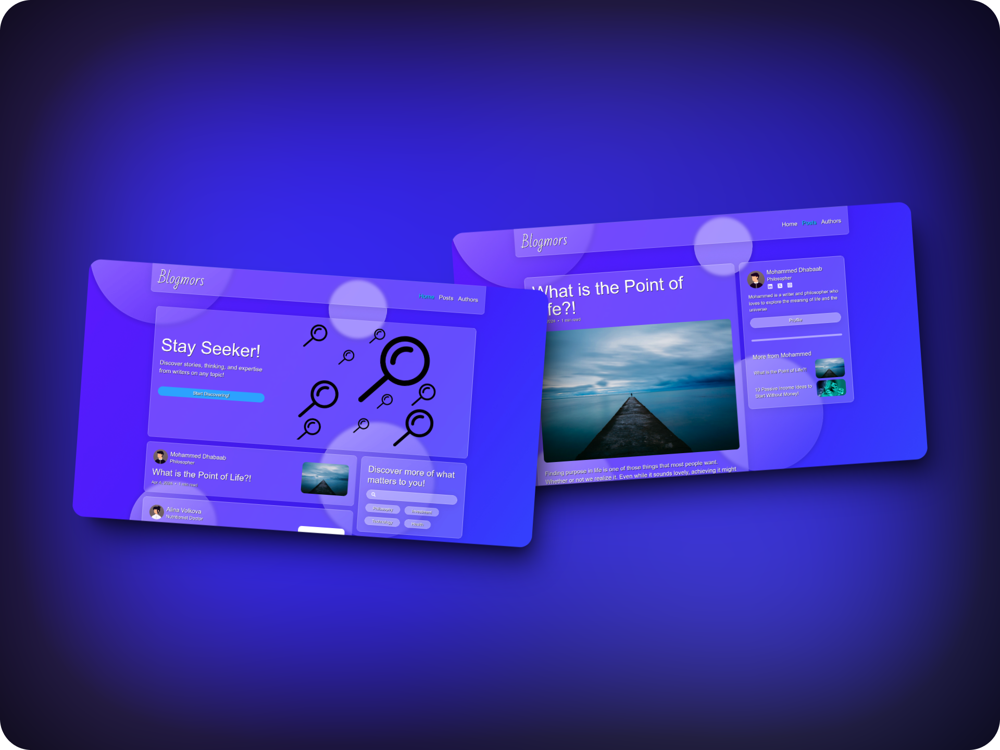

<div style="display:flex; justify-content: center;">
  
</div>

## 📂 Table of Contents

- [📂 Table of Contents](#-table-of-contents)
- [📋 Project Description](#-project-description)
- [✨ Features](#-features)
- [⛏️ Built Using](#️-built-using)
  - [Frontend](#frontend)
  - [Other](#other)
  - [Design](#design)
  - [Assets](#assets)
- [🔍 Explore The Project](#-explore-the-project)
- [🎫 Dependencies](#-dependencies)
- [📥 Installation](#-installation)
- [📝 Usage](#-usage)
- [✍ Contributors](#-contributors)
- [💳 License](#-license)

## 📋 Project Description

A simple modern attractive blog

<div style="display:flex; justify-content: center;">
  
</div>

## ✨ Features

- Simple modern attractive blog
- Clean and visually appealing layout
- Responsive design
- High performs
- Easy navigation
- Searachable posts
- Contain 4 pages
  - Home
  - Posts
  - Post
  - Authors
  - Author

## ⛏️ Built Using

### Frontend

<a href="https://reactjs.org/" target="_blank" rel="noreferrer"> </a>
<a href="https://www.javascript.com/" target="_blank" rel="noreferrer"></a>
<a href="https://vitejs.dev/" target="_blank" rel="noreferrer"></a>
<a href="https://vitest.dev/" target="_blank" rel="noreferrer"></a>
<a href="https://babeljs.io/" target="_blank" rel="noreferrer"></a>
<a href="https://tailwindcss.com/" target="_blank" rel="noreferrer"></a>

### Other

<a href="https://nodejs.org/en/" target="_blank" rel="noreferrer"></a>
<a href="https://git-scm.com/" target="_blank" rel="noreferrer"></a>

### Design

<a href="https://www.figma.com/" target="_blank" rel="noreferrer"></a>
<a href="https://www.adobe.com/uk/products/photoshop.html" target="_blank" rel="noreferrer"></a>
<a href="https://www.canva.com/" target="_blank" rel="noreferrer"></a>
<br>

### Assets

- [Avaters (Cécile L. Parker):](https://dribbble.com/Cecile0112358) Provided avaters
- [@Mohammed-Dhabaab:](github.com/mohammed-dhabaab) Provided some images
- [pixabay:](https://pixabay.com) Provided some images
  - [JillWellington](https://pixabay.com/users/jillwellington-334088/)
  - [B_A](https://pixabay.com/users/b_a-363247/)
  - [ΛΖΞ](https://pixabay.com/users/%CE%BB%CE%B6%CE%BE-3271136/)
  - [StockSnap](https://pixabay.com/users/stocksnap-894430/)
  - [geralt](https://pixabay.com/users/geralt-9301/)

## 🔍 Explore The Project

- [Blogmors](https://mohammed-dhabaab.github.io/blogmors/)

## 🎫 Dependencies

- You can check the package.json file for the project dependencies

## 📥 Installation

1. Clone the project or download the zip version of the project then unzip it
2. You need to install [node.js=20.14.0](https://www.python.org/downloads/release/python-3110/), to ensure compatibility as the project built with it
3. Add node.js to environment variables (PATH)
4. Use the package manager npm to install all the dependencies specified within the package.json file using the command line within the root directory of the project:
   ```shell
   npm install
   ```

## 📝 Usage

To explore Blogmors, follow the following steps:

1. Follow [📥 Installation](#-installation) process
2. Run the development environment or build the production environment
   - To run the development environment, use the following command using the command line within the root directory of the project:
     ```shell
     npm run dev
     ```
   - To build the production environment, use the following command using the command line within the root directory of the project:
     ```shell
     npm run build
     ```

## ✍ Contributors

- Mohammed Dhabaab
  - [Website](https://mohammeddhabaab.com/)
  - [Github](https://github.com/mohammed-dhabaab)

## 💳 License

- [MIT](https://choosealicense.com/licenses/mit/)
