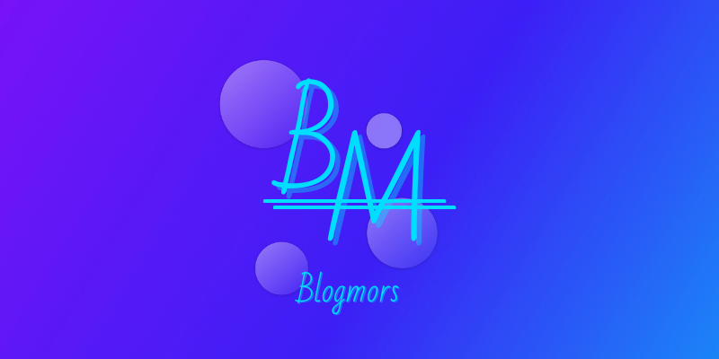

  

  A simple blog.

## 📂Table of Contents
- [📋Project Description](#project-description)
- [⛏️Built Using](#️built-using)
- [✍Authors](#authors)
- [💳License](#license)
- [🏅Acknowledgments](#acknowledgments)

## 📋Project Description
A simple blog consists of two pages, the home page (index.html) and the blog page (blog-post.html) for "What is the Point of Life?!" article **only**.

## ⛏️Built Using
Coding:
- [HTML](https://developer.mozilla.org/en-US/docs/Web/HTML): Structuring
- [CSS](https://developer.mozilla.org/en-US/docs/Web/CSS): Styling

Designing:
- [Figma](https://www.figma.com/): Designing the UI
- [Canva](https://www.canva.com/): Designing 
- [Photoshop](https://www.adobe.com/products/photoshop.html): Designing

Assets:
- [Avaters (Cécile L. Parker)](https://dribbble.com/Cecile0112358): Provided avaters
- [Font Awesome](https://fontawesome.com/v4/icons/): Provided icons
- [@Mohammed-Aldhabaab](github.com/Mohammed-Aldhabaab): Provided some images
- [pixabay](https://pixabay.com): Provided some images
  - [JillWellington](https://pixabay.com/users/jillwellington-334088/)
  - [B_A](https://pixabay.com/users/b_a-363247/)
  - [ΛΖΞ](https://pixabay.com/users/%CE%BB%CE%B6%CE%BE-3271136/)
  - [StockSnap](https://pixabay.com/users/stocksnap-894430/)
  - [geralt](https://pixabay.com/users/geralt-9301/)

## 🔍 Explore The Project
- [Blogmors](https://mohammed-dhabaab.github.io/blogmors/)

## ✍Authors
- [@Mohammed-Aldhabaab](github.com/Mohammed-Aldhabaab)

## 💳License
- [GNU AGPLv3](https://choosealicense.com/licenses/agpl-3.0/)

## 🏅Acknowledgments
- [Udacity](udacity.com)
- [SDA](https://sda.edu.sa/)
- [Cécile L. Parker](https://dribbble.com/Cecile0112358)
- [Font Awesome](https://fontawesome.com/v4/icons/)
